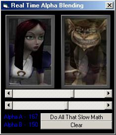



## Real Time Alpha Blending In Pure VB

### Description

If you want to do real time alpha blending in pure VB without API's, DirectX, OpenGL, etc, then this is for you. It uses a few Look Up Tables (LUT's) that pre calculates all the math done and gets the RGB values per pixel from both pictures. The computer will then already know every single combination. That way no math is done at all!!! It's so fast that its as fast as the SetPixel API. LUT's are extremly useful to prevent slowdown. So if you are interested in speed for your applications and/or alpha blending, then this is for you. I have the slow method done first, and when you click the Use Look Up Tables button, it will then be warp speed!
 
### More Info
 
I couldn't really obtain Point(X,Y) in the beginning of the program cause it always read 16777215 making it seem Picture1 was all white. So it's done in the middle of run time instead, which is why the slow method is shown first. If anyone can pull that off when first running the program, please let me know.

             |
---                |---
**Submitted On**   |2002-07-06 17:55:18
**By**             |[KRADLE OF FILTH](https://github.com/Planet-Source-Code/PSCIndex/blob/master/ByAuthor/kradle-of-filth.md)
**Level**          |Advanced
**User Rating**    |4.4 (40 globes from 9 users)
**Compatibility**  |VB 3\.0, VB 4\.0 \(16\-bit\), VB 4\.0 \(32\-bit\), VB 5\.0, VB 6\.0
**Category**       |[Graphics](https://github.com/Planet-Source-Code/PSCIndex/blob/master/ByCategory/graphics__1-46.md)
**World**          |[Visual Basic](https://github.com/Planet-Source-Code/PSCIndex/blob/master/ByWorld/visual-basic.md)
**Archive File**   |[Real\_Time\_102952762002\.zip](https://github.com/Planet-Source-Code/kradle-of-filth-real-time-alpha-blending-in-pure-vb__1-36660/archive/master.zip)

